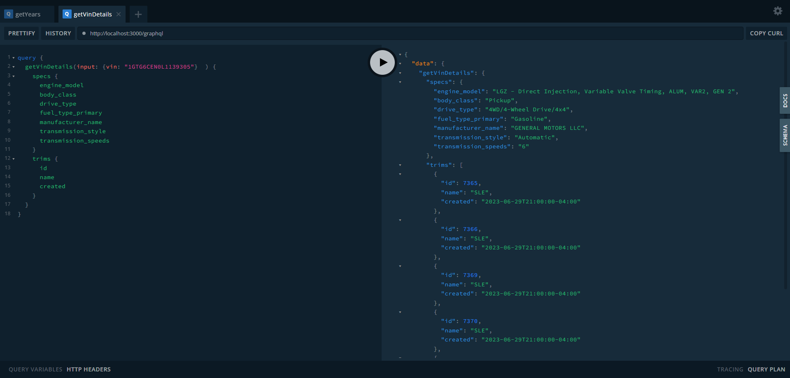
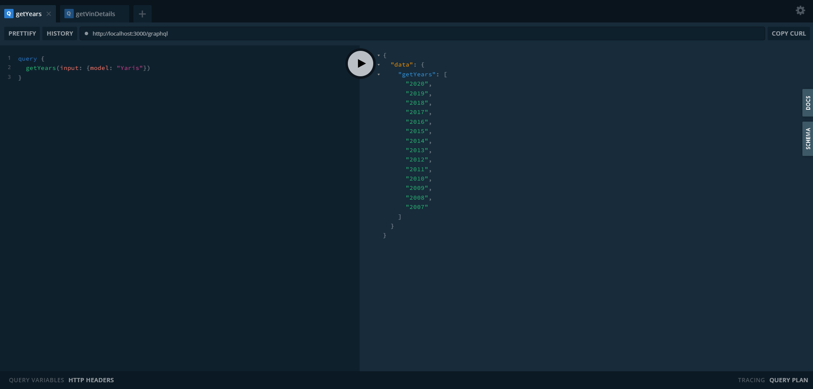
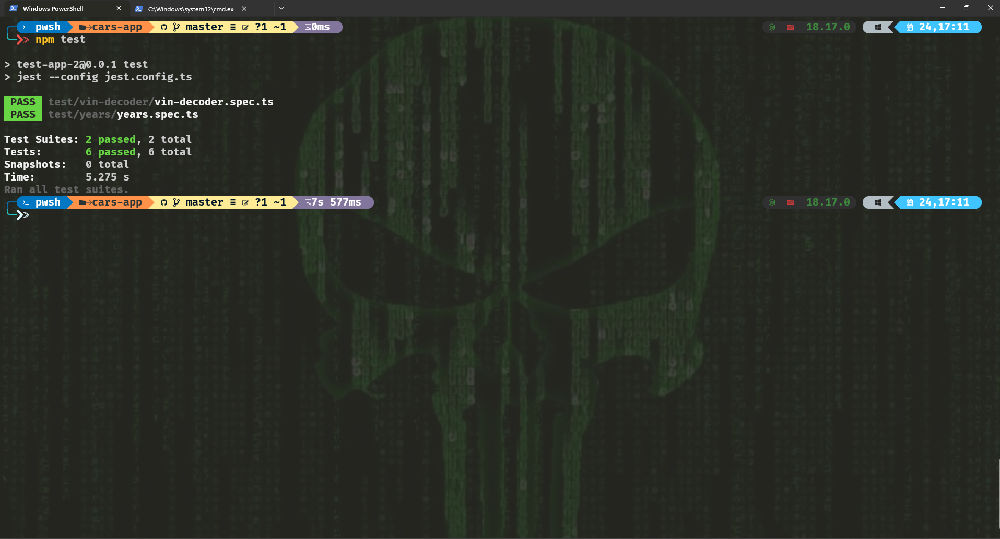
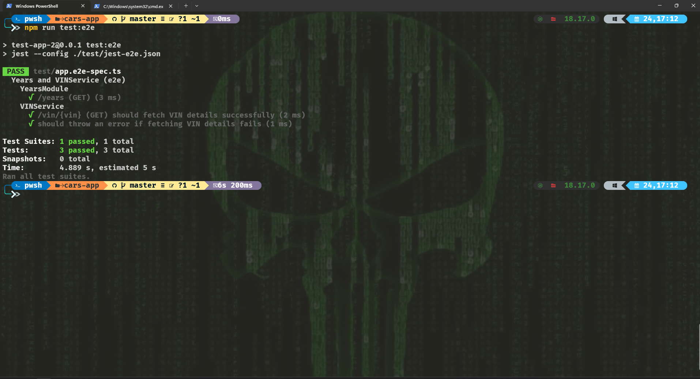

# Project Name

## Cars App

## Table of Contents

- [Introduction](#introduction)
- [Features](#features)
- [Getting Started](#getting-started)
  - [Installation](#installation)
- [Usage](#usage)
- [Screenshots](#screenshots)

## Introduction

The Cars App is a project based on cutting-edge technologies like NestJS, GraphQL, and TypeScript.
We interact with our code using a 3rd-party API, allowing you to fetch various data related to cars. For more information, you can refer to the GraphQL schema.

## Features

Highlighting some key features of the project:

- A specific endpoint where you can provide different query parameters to retrieve car years that match your search.
- Our core functionality includes the VIN Decoder endpoint. By entering a car's VIN, you receive important information about the vehicle.
- ...

## Getting Started

Ensure that you are using Node.js version 18.17.0. If you need different versions for various projects, you can use NVM, which provides excellent version control.

### Installation

Follow these step-by-step instructions to install the project:

1. Run `npm install`.
2. Run `npm run build`.
3. Run `npm start`.

For additional commands, refer to the `package.json` file, specifically the scripts section.

## Usage

Here you can find real tests of the app that will help you understand it better.

## Screenshots

